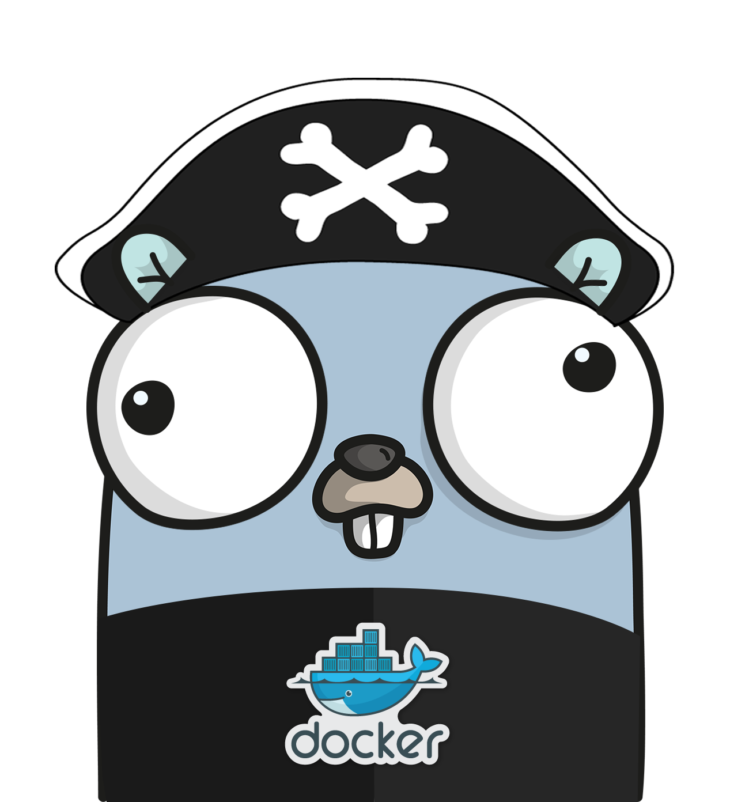

# godock

<div style="display: flex; align-items: center; justify-content: space-between;">
  <div>
    A opinionated declarative, developer-friendly wrapper around Docker's Go SDK.
  </div>
  
</div>


  [](https://goreportcard.com/report/github.com/aptd3v/godock)
  [](https://godoc.org/github.com/aptd3v/godock)
  [](LICENSE)

## Overview

godock simplifies Docker operations in Go by providing:

- 🎨 **Clean API** - Intuitive configuration with clear function names
- 🏗️ **Resource Management** - Simple container, network, and volume operations
- 🔍 **Error Handling** - Detailed error types for better debugging
- 📦 **Composable Options** - Mix and match configuration options easily

## Installation

Using `go get` (outside a module):
```bash
go get github.com/aptd3v/godock@latest
```


### Requirements
- Go 1.21.0 or later
- Docker Engine API version 1.41 or later
- Docker Engine running locally

## Usage Examples

### Container Management
```go
package main

import (
    "context"
    "github.com/aptd3v/godock/pkg/godock"
    "github.com/aptd3v/godock/pkg/godock/container"
    "github.com/aptd3v/godock/pkg/godock/containeroptions"
    "github.com/aptd3v/godock/pkg/godock/hostoptions"
)

func main() {
    ctx := context.Background()
    client, _ := godock.NewClient(ctx)

    container := container.NewConfig("app")
    container.SetContainerOptions(
        containeroptions.Image("app:latest"),
        containeroptions.Expose("8080"),
        containeroptions.Env("APP_ENV", "prod"),
    )
    container.SetHostOptions(
        hostoptions.Memory(1*1024*1024*1024),
        hostoptions.CPUQuota(2),
        hostoptions.RestartAlways(),
    )

    client.ContainerCreate(ctx, container)
    client.ContainerStart(ctx, container)
}
```

### Network Management
```go
// Create a network
network := network.NewConfig("app-net")
network.SetOptions(
    networkoptions.SetDriver("bridge"),
    networkoptions.SetSubnet("172.20.0.0/16"),
    networkoptions.SetGateway("172.20.0.1"),
)

// Configure endpoint settings
endpoint := endpointoptions.NewConfig()
endpoint.SetEndpointSetting(
    endpointoptions.IPv4Address("172.20.0.2"),
    endpointoptions.IPv4Gateway("172.20.0.1"),
    endpointoptions.IPv4PrefixLen(16),
    endpointoptions.Aliases("api-service", "web-backend"),
    endpointoptions.Links("redis:cache"),
)

// Attach container to network
container.SetNetworkOptions(
    networkoptions.Endpoint("app-net", endpoint),
)
```

### Volume Management
```go
volume := volume.NewConfig("data")
volume.SetOptions(
    volumeoptions.SetDriver(volumeoptions.LocalDriver),
    volumeoptions.AddLabel("env", "prod"),
)

container.SetHostOptions(
    hostoptions.Mount(hostoptions.MountType("volume"), "data", "/app/data", false),
)
```

### Error Handling
godock provides rich error types and helper functions for robust error handling:

```go
import (
    "github.com/aptd3v/godock/pkg/godock"
    "github.com/aptd3v/godock/pkg/godock/errors"
)

// Create and start a container
err := client.ContainerCreate(ctx, config)
if err != nil {
    // Check error types
    switch {
    case errors.IsNotFound(err):
        // Handle missing image or resource
        var nfe *errors.ResourceNotFoundError
        if errors.As(err, &nfe) {
            log.Printf("Resource %s with ID %s not found", 
                nfe.ResourceType, nfe.ID)
        }
        
    case errors.IsAlreadyExists(err):
        // Handle duplicate resources (e.g., container name)
        var ee *errors.ResourceExistsError
        if errors.As(err, &ee) {
            log.Printf("Resource %s with ID %s already exists", 
                ee.ResourceType, ee.ID)
        }
    }
    return
}

// Start the container
err = client.ContainerStart(ctx, config)
if err != nil {
    switch {
    case errors.IsAlreadyExists(err):
        // Handle resource conflicts (e.g., port already in use)
        var ee *errors.ResourceExistsError
        if errors.As(err, &ee) {
            log.Printf("Resource %s with ID %s already exists", 
                ee.ResourceType, ee.ID)
        }
        
    case errors.IsInvalidConfig(err):
        // Handle configuration errors
        var ve *errors.ValidationError
        if errors.As(err, &ve) {
            log.Printf("Invalid configuration for %s: %s", 
                ve.Field, ve.Message)
        }
        
    case errors.IsDaemonNotRunning(err):
        // Handle Docker daemon issues
        log.Print("Docker daemon is not running")
        
    case errors.IsTimeout(err):
        // Handle timeout errors
        log.Print("Operation timed out")
        
    default:
        // Handle other error types
        switch e := err.(type) {
        case *errors.ContainerError:
            log.Printf("Container %s: %s failed: %s", 
                e.ID, e.Op, e.Message)
        case *errors.NetworkError:
            log.Printf("Network %s: %s failed: %s", 
                e.ID, e.Op, e.Message)
        case *errors.VolumeError:
            log.Printf("Volume %s: %s failed: %s", 
                e.Name, e.Op, e.Message)
        }
    }
}
```

# Key features:
- Type-safe error checking with `errors.Is` and `errors.As`
- Resource-specific error types (Container, Network, Volume)
- Operation-specific error handling (Create vs Start)
- Detailed error context (resource IDs, operation names, messages)
- Common error categories:
  - `NotFound`: Missing images, containers, or other resources
  - `AlreadyExists`: Duplicate container names (during create) or ports (during start)
  - `ValidationError`: Invalid configuration or parameters
  - `ContainerError`: General container operation failures
  - `NetworkError`: Network operation failures
  - `VolumeError`: Volume operation failures
- Operation errors:
  - `Timeout`: Operation exceeded time limit
  - `Canceled`: Operation was canceled
  - `DaemonNotRunning`: Docker daemon unavailable

## Project Structure
```
godock/
├── examples/                # Example applications
│   └── *examples/          # Various implementations
├── pkg/
│   └── godock/            # Main package
│       ├── client.go      # Core client
│       ├── container/     # Container operations
│       ├── errors/        # Error handling
│       ├── exec/          # Exec operations
│       ├── image/         # Image operations
│       ├── network/       # Network operations
│       ├── networkoptions/# Network options
│       ├── terminal/      # Terminal utilities
│       └── volume/        # Volume operations
├── CONTRIBUTING.md        # Contribution guide
├── LICENSE               # MIT License
└── README.md            # Documentation
```

## Documentation
- [GoDoc Reference](https://godoc.org/github.com/aptd3v/godock)
- [Examples Directory](./examples)
- [Contributing Guide](CONTRIBUTING.md)

## Support
- GitHub Issues: Bug reports and features
- Discussions: Questions and ideas
- Pull Requests: Contributions welcome

## Contributors

Thank you to all the contributors who have helped improve godock! 

<table>
  <tr>
    <td align="center">
      <a href="https://github.com/aptd3v">
        <br />
        <sub><b>aptd3v</b></sub>
      </a><br />
      <sub>Project Creator</sub>
    </td>
  </tr>
</table>

Want to contribute? Check out our [Contributing Guide](CONTRIBUTING.md) to get started!

## License
godock is released under the MIT License. See [LICENSE](LICENSE) for details.
